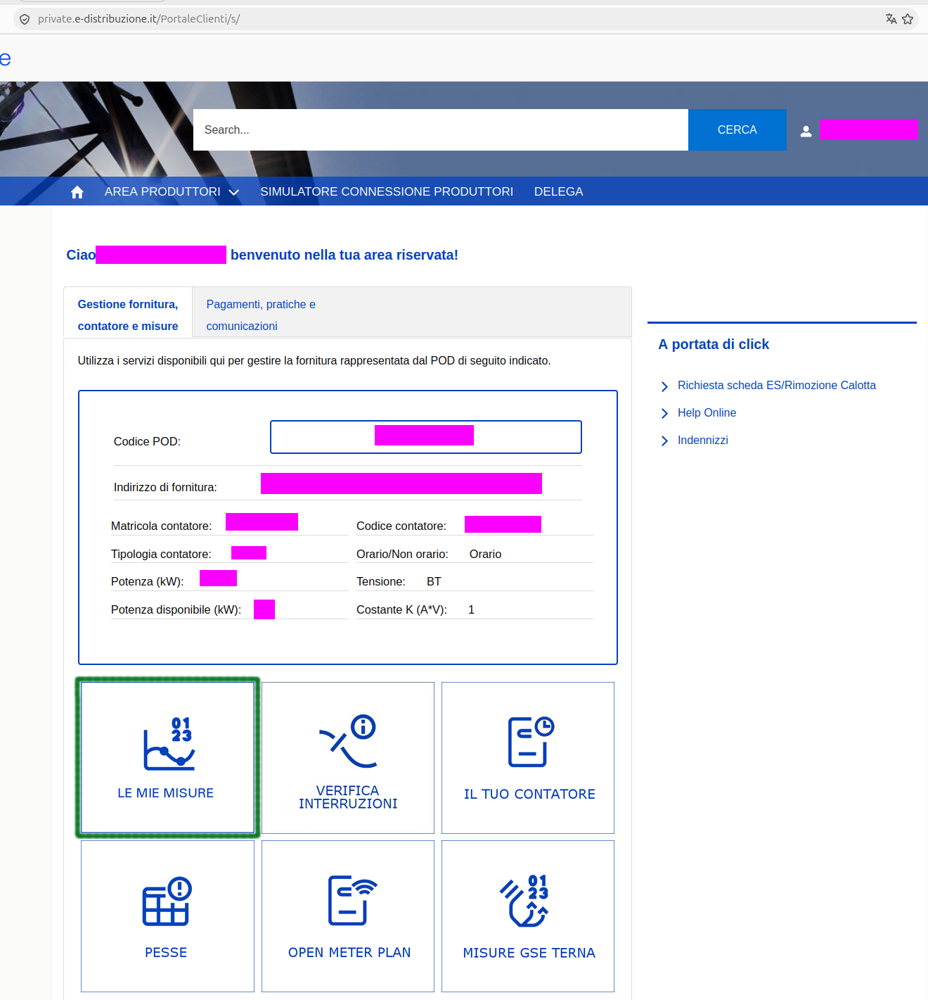
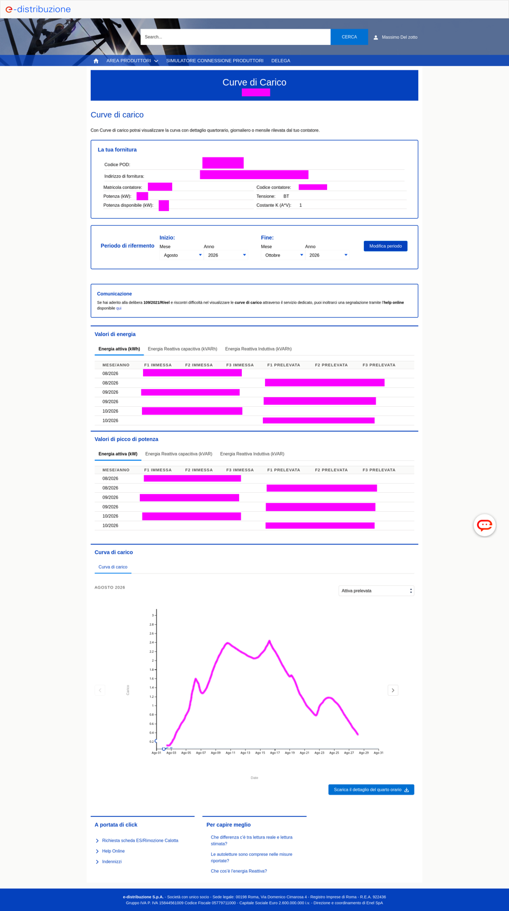
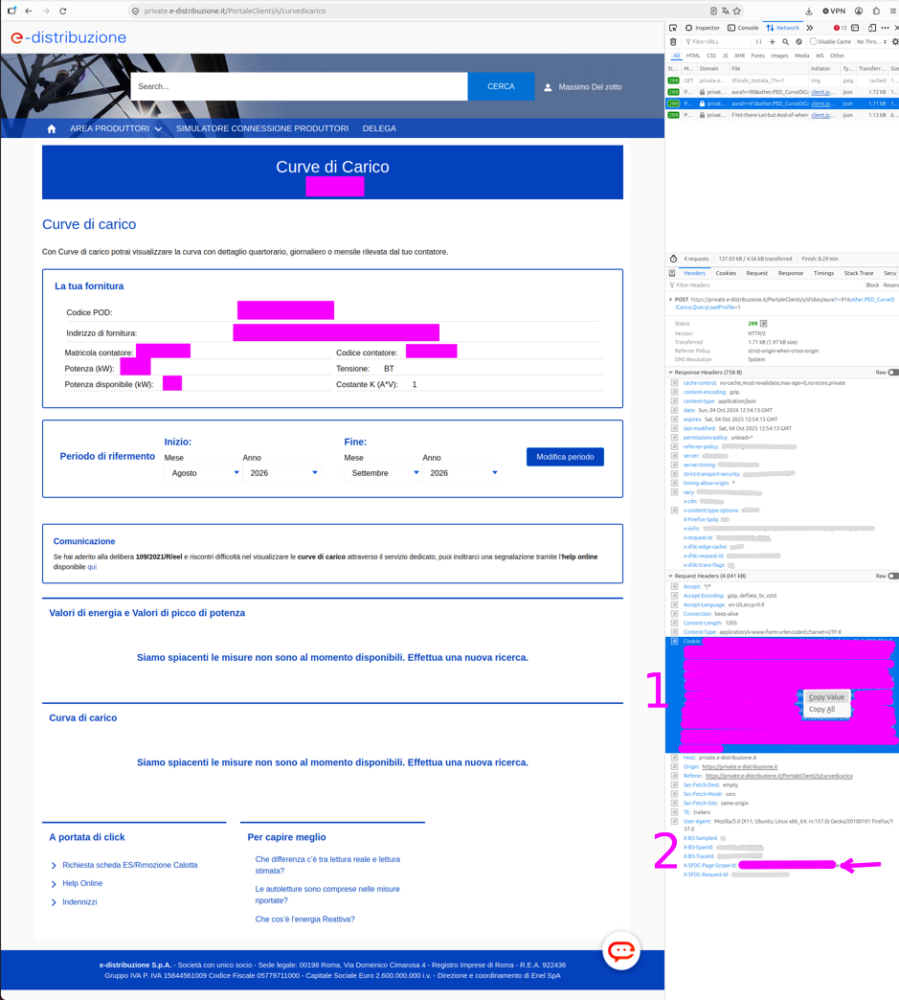
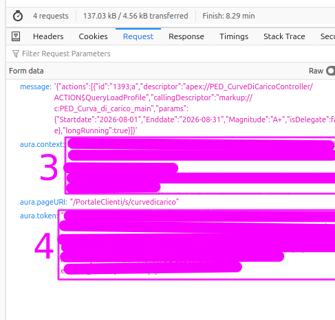

# Script per dati da e-distribuzione

Nel 2023 il mio rapporto con il fotovoltaico di casa è diventato più complicato. &Egrave; diventato necessario farmi un'idea migliore dei numeri in gioco. Il sito di e-distribuzione per quanto funzionale ha mostrato diversi inconvenienti, alcuni che ricordo:

1. **Lentissimo**: d'accordo, lo si può usare per dare un'occhiata ai consumi del mese scorso e con un po' di pazienza ricavarne qualcosa in più, diventa presto tedioso;
2. **Inaffidabile**: non so da che cosa dipenda ma in più occasioni le richieste sembravano andare in timeout, spesso senza nemmeno alcun avvertimento e a volte costringendomi al logout;
3. **Incoerente**: si selezionano mesi di cui il grafico "giustamente" mostra le curve su base *giornaliera* ma il file da scaricare riporta le misure al quarto d'ora;
4. **Approssimativo**: il grafico sui giorni del mese è troppo semplificato per avere intuizioni significative.

Qualcuno che come me voglia esaminare i dati ad esempio dell'ultimo anno si trova a dover fare un sacco di click, un lavoro manuale lungo e ad alto rischio d'errori. Non bastasse, questi dati vanno poi messi assieme e gestiti magari in un foglio di calcolo cosa che ha a sua volta alcune complicazioni per non parlare di eventuali elaborazioni più fini.

Il che ci porta a queste utility. Spero che aiuteranno a migliorare la comprensione che ciascuno può e dovrebbe avere dei propri consumi e delle bollette. L'argomento energia elettrica è complesso e dati aperti e manipolabili sono la base su cui si traggono decisioni informate.

# `dl_quarters.py`

> _Intento:_
>
> Scarica i dati da e-distribuzione come farebbe un browser.

Partendo dalla pagina principale di e-distribuzione, cliccando sulla sezione "Le mie misure"



Si arriva alla pagina "Curve di carico" e qui iniziano i guai perchè impiega un po' a popolarsi.



Il programma è un modo automatizzato per impostare il periodo di riferimento (nella sezione dedicata) ed eventualmente la curva desiderata (subito sopra il grafico).

Una cosa che può sembrare strana: vorrei poter scrivere che:

> il programma fa una serie di click e produce il risultato corrispondente all'usare il bottone "Scarica il dettaglio del quarto d'ora"

Ma a sorpresa, **e-distribuzione non invia quel file**. `dl_quarters.py` produce in uscita esattamente ciò che i server e-distribuzione inviano al browser. Per farlo, si presenta ai server e-distribuzione come il vostro browser ha appena fatto. Questo significa che bisogna fornire **informazioni riservate** che vanno estratte dallo stato del browser. Il programma riutilizza le informazioni di login ed OTP inserite nel browser per generare le sue richieste.

1. Aprire i _developer tools_ del browser; spesso è sufficiente premere F12 sulla tastiera;
2. Cercare la tab relativa al traffico di rete, generalmente "Network"
3. Cambiare il periodo di riferimento, ad esempio portando la "Fine" al mese precedente;
4. Nella tab del traffico, selezionare la nuova richiesta.

Da qui si possono estrarre i dati d'autenticazione. Servono i valori di

1. Dai dati della richiesta
    - cookie
    - x-sfdc-page-scope-id
2. Dalla richiesta vera e propria
    - aura.token
    - aura.context.value



Si raccomanda usare "copia valore", facendo click col pulsante sinistro del mouse. Incollare quando richiesto. Punti bonus per i malfunzionamenti come in questo caso (che stranamente sembrano essere più rari usando lo script).
Per quanto riguarda la seconda coppia di valori, spostarsi sulla sotto-tab "richiesta".




> ⚠️ **ATTENZIONE: DATI RISERVATI**
>
> I campi indicati sono **credenziali d'accesso** associate alla vostra attività. Trattateli come una password.
> Manteneteli al sicuro. Non forniteli a terze parti.
>
> Il programma ne mantiene una copia in memoria per il solo tempo necessario all'esecuzione.

## Esecuzione

```
python3 dl_quarters.py
```
Il programma chiederà nell'ordine
 
1. cookie
2. x-sfdc-page-scope-id
3. aura.token
4. aura.context
5. la data d'inizio (primo giorno o mese incluso)
6. la data finale (ultimo giorno o mese incluso)

Per i quattro valori presi dal browser raccomando "copia valore" (pulsante destro).

### Parametri aggiuntivi

- `--start`
    - indica da linea di comando la data iniziale
    - il programma non la chiederà
- `--end`
    - omologo a `--start` per la data finale
- `--no-pod-prefix`
    - omette il codice POD dal nome dei file creati
- `--energy-types`
    - seleziona le curve da scaricare
    - default "attiva-prelevata,attiva-immessa"
    - alcune ammettono nomi brevi (R1, R2, R3, R4)
    - vedere il codice per le stringhe precise

<div style='background-color:22FF2250'>
Nota: la date sono da indicarsi nella forma di ANNO-MESE-GIORNO ma è possibile omettere il giorno. Ad esempio, indicando come data iniziale 2026-03 e finale 2026-06 il programma scarica i quarti d'ora da 2026-03-01 00:00 a 2026-06-30 23:45 estremi compresi.
</div>

## Output

Per ciascuna curva richiesta crea un file <span style="background-color:AAAAFF88>">[POD_]</span>YYYY-MM_&lt;curva&gt;.json.

Usando l'opzione `--no-pod-prefix` si può omettere il codice POD da ciascun nome.

Il programma scrive a console (su <em>stdout</em>) una riga per ciascun file creato; tutto il resto sono informazioni scritte su <em>stderr</em>.
